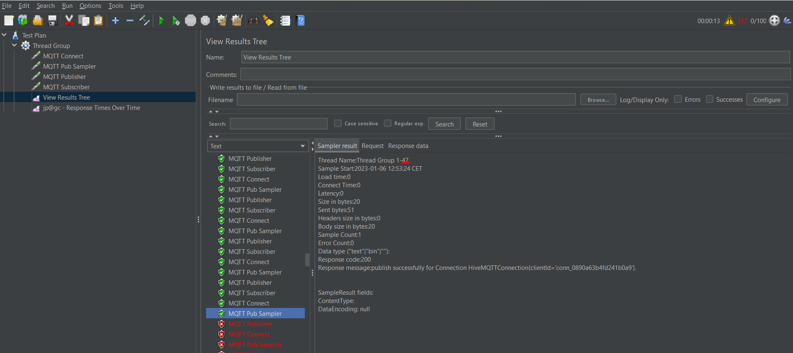
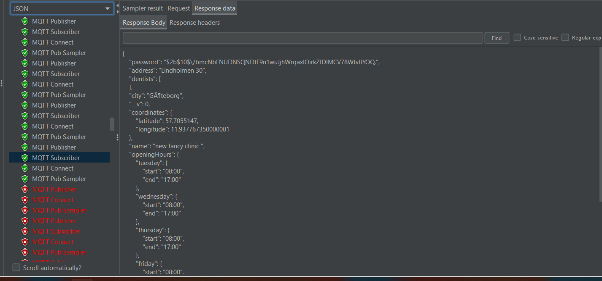
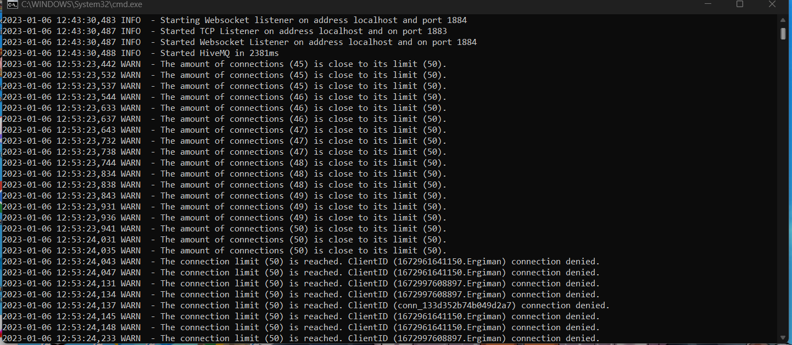
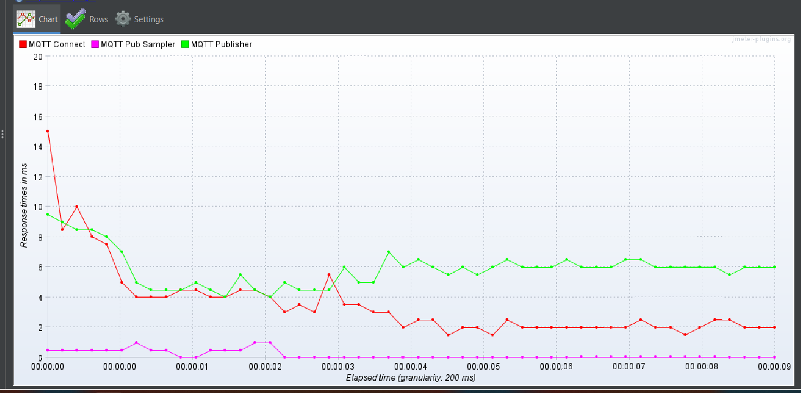
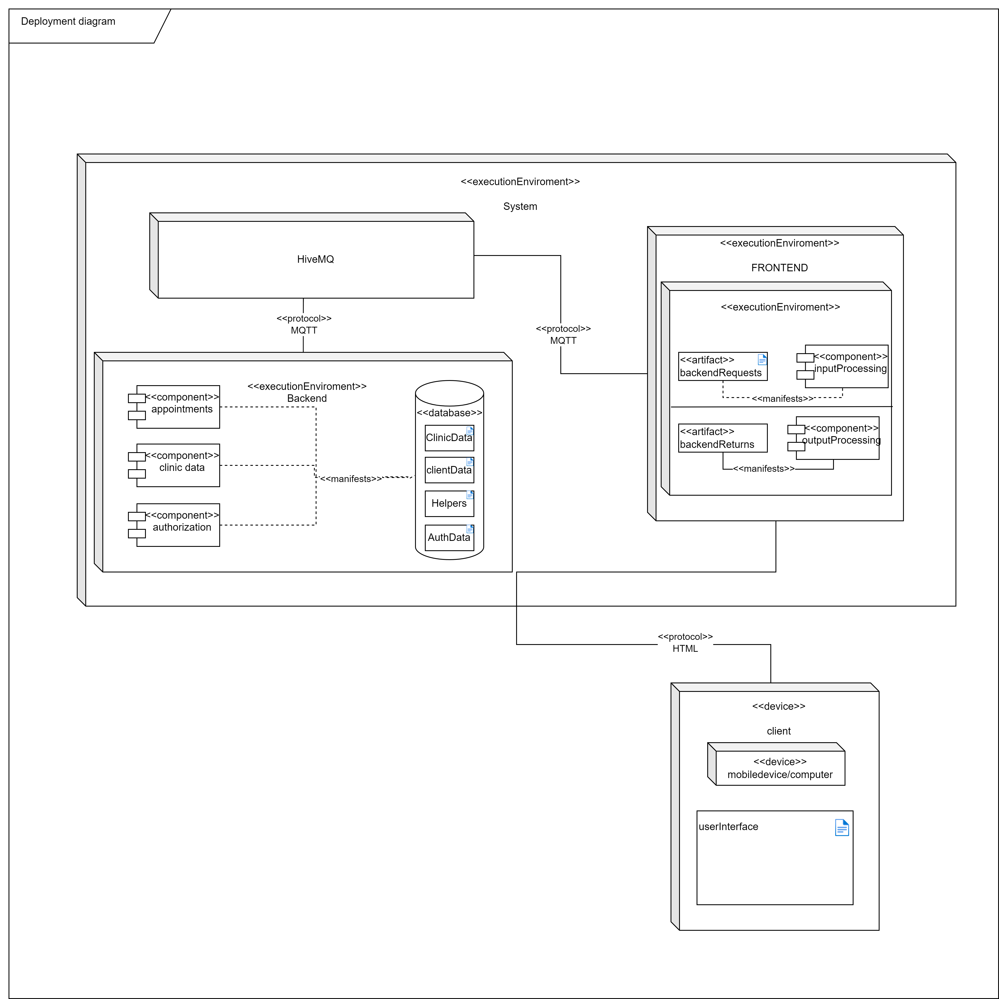
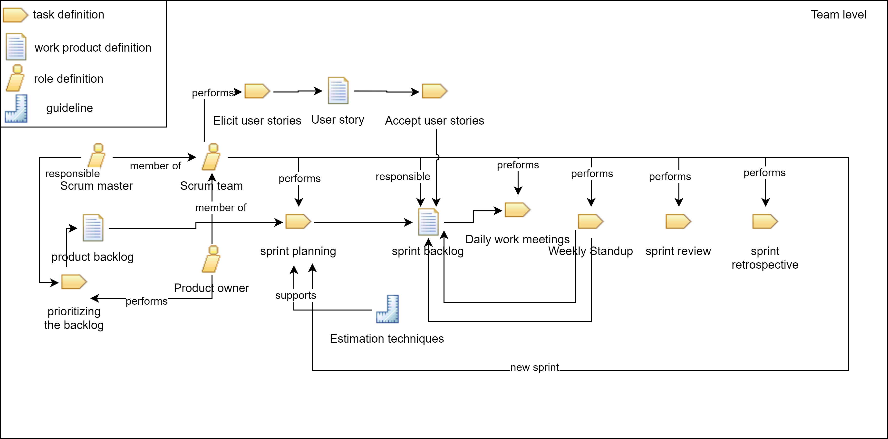

# T7 Project
## Dentistry - For people who love to smile. 😀

## Table of Contents
| Title                                                                                                                       | Description |
| ------                                                                                                                      | ------ |
| [Appointments Service](https://git.chalmers.se/courses/dit355/dit356-2022/t-7/t7-project/-/tree/main/server/appointments)   | Directory that handles booking appointment from the MQTT side of the application.     |
| [Authorization Service](https://git.chalmers.se/courses/dit355/dit356-2022/t-7/t7-project/-/tree/main/server/authorization) | Directory that handles succeful log in and authorization of a Clinic.       |
| [Clinic Data Service](https://git.chalmers.se/courses/dit355/dit356-2022/t-7/t7-project/-/tree/main/server/clinic_data)     | Directory that helps interact with Clinic data stored in the database via MQTT broker.     |
| [Helpers and Schemas](https://git.chalmers.se/courses/dit355/dit356-2022/t-7/t7-project/-/tree/main/server/helpers)         | A helpers directory which also includes schemas for each entity.       |
| [Front-end side](https://git.chalmers.se/courses/dit355/dit356-2022/t-7/t7-project/-/tree/main/client)                      | The Client side react based application that runs on a local host       |


## Description
This web application is a platform to help you book a dentist appointment in Gothenburg for your desired clinic at your desired time. The application displays the clinic on a map using Google API, so the patients or users can get an exact idea of the clinic's location.
Moreover, the highly interactive calendar displays all the available timeslots for a selected clinic in a weekly format. This system allows the patient to select his suitable time. 
Our application also allows the dental clinic to create a secured account with us. The purpose of the account is to manage the clinic's opening hours, input how many dentists are available and also help the patients to cancel an appointment if needed. Once a patient successfully books an appointment, a confirmation email containing all the necessary details is sent to the provided email address.


## Installation
Here are the installation steps in order to run the project and import it in your IDE:

### Steps

1. Clone the repository
2. Run "npm install" on all the package files that are in the folders.
3. For the HiveMQ broker to work, a network and an account has to be set up. The account information must be placed in a config file called "config-server" within the helpers' folder.
4. The MQTT broker must also be installed in the device. The communication network host HiveMQ broker is required.
5. After that, the batch file within the bin folder of the downloaded HiveMQ must be run as administrator. That opens and runs the local broker.
6. A connection to a MongoDB database is also required. That is also done by putting relevant MongoDB connection information in the "config-server" config file within the helpers' folder.
7. After completing the steps above, run these backend components by navigating to their respective folder:
   ```
   clinic_data_app.js
   appointments_app.js
   authorization_app.js
   ```
8. Finally, in order to run the client, navigate to the client directory and do "npm start":
   ```
   cd client
   npm start
   ```
   Those are all the steps, you're all set!


### Links

- HiveMQ getting started page: https://www.hivemq.com/docs/hivemq/4.10/user-guide/getting-started.html#get-started.

- Installation of local HiveMQ broker: https://www.hivemq.com/docs/hivemq/4.10/user-guide/install-hivemq.html.

- Setting up MongoDB database: https://www.mongodb.com/basics/create-database


### Technologies

Here are the technologies that we used in our project:

1. Webstorm IDE
2. React JS frontend framework
3. Node JS backend framework
4. MQTT communication protocol
5. Jmeter with MQTT plugin(for MQTT load testing)
6. MongoDB

## Testing
When it comes to testing, we've got unit tests that test every backend method and endpoint to ensure that they work as
intended, and we also have CI/CD tests that run each time someone makes a merge request to ensure that nothing is broken
when we commit our code. We also have an MQTT load tester. For that we use an external tool called Jmeter with the mqtt plugin
installed. The purpose it serves is to test the limits of our backend(the HiveMQ broker) and see if all connected clients
get their responses back even when the system is close to its limit. The screenshots below show the tool in use:

The amount of clients connected and the successful publishes:



This is the 47th client(user) getting the response with the clinic information, which shows resilience in our system and 
that the messages get delivered even when the broker is near its limit(50 in this case):



This is how things look on the broker's end: 



This is the generated graph that shows response times over time(10 seconds) for each test:




# Project Brief

## Purpose

| Authors           | Roles                    |
|-------------------|--------------------------|
| Agata Ciuchta(@ciuchta)     | Developer                |
| Aieh Eissa(@aieh)        | Developer                |
| Burak Askan(@askan)       | Developer                |
| Ergi Senja(@ergi)        | Project Owner, Developer |
| Mathias Hallander(@mathalla) | SCRUM Master, Developer  |
| Ossian Ålund(@ossiana)      | Developer                |
| Sejal Kanaskar(@sejal)    | Developer                |

### Source Links
Following are the links to related sources our team used for project management:

1. [Trello board](https://trello.com/invite/b/UpF9cpfb/ATTId24776e83841bd47da5211d78112b2977C054535/dentistry)
2. [Google drive](https://drive.google.com/drive/u/1/folders/1M0N4O0_uUcaB4gn_9-U_CHiw7DF_6Oty)
3. [Miro](https://miro.com/app/board/o9J_ljlFCrw=/)
4. [diagram.net](https://www.diagrams.net/)
5. [Figma](https://www.figma.com/file/WaKn8d47HdUDVoYeB0rFN5/Dental-Web?t=JZw7vMfmfsaPRnQm-0)


### Links to the other components/directories

1. [Authorization service](https://git.chalmers.se/courses/dit355/dit356-2022/t-7/t7-project/-/tree/main/server/authorization)
2. [Clinic data service](https://git.chalmers.se/courses/dit355/dit356-2022/t-7/t7-project/-/tree/main/server/clinic_data)
3. [Appointments service](https://git.chalmers.se/courses/dit355/dit356-2022/t-7/t7-project/-/tree/main/server/appointments)
4. [Helpers (includes ER diagram)](https://git.chalmers.se/courses/dit355/dit356-2022/t-7/t7-project/-/tree/main/server/helpers)
5. [Client (includes screenshots of our interface)](https://git.chalmers.se/courses/dit355/dit356-2022/t-7/t7-project/-/tree/main/client)

## Software Requirements Specification
All the requirements below can be found on the [closed issues] () section of our repository
<details>
   <summary>View all requirements</summary>

1. **Set break times as a clinic** <br>
As a clinic, I want to set _fika_ and lunch hours for dentists, so that no timeslots are available at that time.
2. **Add dentist to the clinic** <br>
As a clinic, I want to set _fika_ and lunch hour for dentists, so that no timeslots are available at that time.
3. **Clinic login** <br>
As a clinic, I want to be able to log in to the website.
4. **Clinic registration** <br>
As a clinic, I want to be able to create an account, so that I can manage my dentists and appointments.
5. **Session ID** <br>
As a clinic, I want a session ID to be generated so that I can remain logged-in
6. **Security - clinic** <br>
As a clinic, I want my registered information to be safe.
7. **Update clinic information** <br>
As a clinic, I want to update my information, so that the patients stay up to date.
8. **View all clinics** <br>
As a user, I want to view a list of all clinics on the application, so that I can select my desired clinic.
9. **Cancellation notification to a patient** <br>
As a patient, I want to be notified in case my appointment gets canceled.
10. **Confirmation email to the patient** <br>
As a patient, I want to receive a confirmation email when I successfully book an appointment.
11. **Email confirmation to the clinic** <br>
As a clinic, I want to receive an email when an appointment has been scheduled with me, so that I can keep track of my appointments easily.
12. **View booked appointments as a clinic** <br>
As a clinic, I want to be able to view my appointments.
13. **Cancel appointment as a clinic** <br>
As a clinic, I want to be able to cancel a booked appointment in case of changes in schedule.
14. **Home page for the patients** <br>
As a patient, I would like to have a home page for the platform, so that I can navigate and get a better understanding of the website.
15. **Home page for the clinics** <br>
As a clinic, I would like to have a home page for the platform, so that I can navigate and get a better understanding of the website.
16. **Clinics map** <br>
As a user, I want a map view of available clinics in Gothenburg
17. **Update dentist information** <br>
As a clinic, I want to be able to edit the profile of our dentists, so that I can keep it up to date.
18. **Set available time slots** <br>
As a clinic, I want to be able to set the working days for the dentists, so that patients can see them.
19. **Book time slot** <br>
As a patient, I want to be able to book an appointment on an available time slot.
20. **View time slots** <br>
As a patient, I want to find available time slots for all dentists, so that I can choose a time and a dentist that works for me.
21. **View available dentists on a specific time slot** <br>
As a patient, I want to be able to see which dentist is available for a specific time slot.
22. **View time slots of a specific dentist** <br>
As a patient, I want to be able to see the available time slots for a specific dentist.
</details>


## Software Architecture Document

### Conceptual Architectural Design
We decided to combine three different architectural styles which are:
1. Publish/subscribe architecture which is implemented using an MQTT broker as a middleware to send publish and subscribe requests.
2. Client-server architecture which uses a 3-tier system where the middleware (here MQTT) will receive requests from the client (here subscriptions) and send them to the server to handle them appropriately
3. Service-based architecture ensures consistency between different repositories and extensibility to add functionality to the system in the future. 
<br> All these architectural styles support efficiency and scalability. The **deployment diagram** below gives an idea of how our system works:
   
   

### Mapping the design to our technologies
Our system is divided into 5 distributed modules which communicate together via MQTT 
Three of them are the backend components: _clinic data service, authorization and appointments_. 
There is one frontend component: _frontend service_. The _HiveMQ_ is the 5th component and serves as a broker. <br>
The reasoning for this system structure is that it meets the requirements of a distributed system. 

### Architectural design decision and tactics
<details> <summary>The above-mentioned design style for our project was carefully chosen and implemented to meet the following tactics: </summary>

<p>The backend components originate from separation of concern, as  they should be as independent as possible. 
What is more, all components subscribe to different topics that are unique to them. No component will get a duplicated 
message and no identical message will be sent to multiple components. Their structure requires an unique identifier 
which guarantees uniqueness to messages being responded to by including a unique identifier in the message payload from the frontend. </p>
<p>The quality of the broker used in our system has a quality of service of 0, whereas our fault tolerance which is built 
in the system is equivalent to quality of 2. The reason behind this is when we send a message and no response is received, 
the user is redirected to an error page. </p>
<p>Our repository consists of several directories, each of them serving a different purpose. The helpers directory includes: 
config file, mongoose handler, MQTT handler and schema. The purpose of this directory is to directly improve reusability 
of the project where all backend components use this rather than individual setup for each component. Each backend component 
is composed of two parts - application (runnable application) and controller (the point through which the application interacts 
with the database). </p>
<p> As for the frontend it is a very typical react project with directories representing the features of the website. 
In addition to that we have directories for assets and common components used across the entire webpage. The MQTT setup 
in the frontend is based on a “use when needed” basis. A web page will create a MQTT client when it needs one, otherwise 
this will not occur. This is due to limitations regarding react state and our intention to keep things to a single page 
application where uniqueness is guaranteed among all features. </p>
<p> We have a CI/CD pipeline that ensures that our program is stable and functional all the time. Pipeline will run 
concurrent tests to fully test the distributed nature. We also have an MQTT load tester that tests the limit of our 
backend(which is 50 users) and ensures that all of them get their responses even if the MQTT broker is close to its limits. </p>
</details>


## Project Management Report

### Project Management Practices and Tools
<details> <summary> The project management practises and tools we used are the following: </summary>
<p>For the process model, we decided to combine Scrum, user stories and incremental delivery. Scrum is essential since 
it’s an agile approach which will help the team coordinate better and be more flexible. A project like this benefits from 
being divided into easily manageable sprints. Before each sprint, we performed sprint planning when everyone was assigned tasks. 
At the end of every sprint we would perform a review to reflect on our project development and a retrospective to analyze if we 
could somehow improve our process. If there were some issues, we would adjust our process to solve them. </p>
<p>At the beginning of the project, we used MoSCow to prioritise the tasks.  It helped us understand the importance of them. 
After that we could easily plan and distribute the user stories for each sprint and milestone </p>
<p>To track our user stories, and how they are progressing, we used Trello board. It consisted of 6 different phases, which were: 
(Project) Backlog, Sprint Backlog, Doing, Waiting, Done and Cancelled. Moreover, we labelled each user story with a corresponding 
description for example “must”, “optional” etc. We wrote acceptance criteria and included a checklist for each task. It helped us 
visualise the stage of our project, together with the progress. </p>
<p>What is more, we created a Burnup chart tracking time spent on user stories and analyzing progress based on a chart focusing 
on Actual, Earned and Expected time.</p>
<p>In addition, we implemented a Gantt chart to portray how we plan our overall project to look like with considerations to time 
together with dependencies that exist. That also showed our progress with the various developments.
We created a SPEM diagram to visualize the development process we used.</p>



</details>

### Project Management Decisions and Schedule
<details> <summary> Our schedule and project management decisions are the following: </summary>
<p> In our team contract we established how the division and execution of tasks will be handled. We agreed that the work 
would be distributed as evenly as possible, with consideration for individual skill levels. Moreover, we would help each 
other if someone was struggling with implementing a specific feature. We agreed that if any obstacles were encountered, 
all members were responsible for informing the group in advance. Everyone was answerable to update the relevant parts of 
Trello board, as well as GitLab repository.</p>
<p>We agreed that team decisions would be made based on consensus, by analyzing the pros and cons of the specific solution
and trying to find a fair and rational result.</p>
<p> The entire project was divided into five milestones. Each milestone had a duration of 2 weeks. At the start of every milestone, 
the team would conduct a planning meeting and simultaneously at the end of every milestone a retrospective and review meeting would 
be held. This structure would assist in keeping track of the progress and also identify our mistakes and problems.</p>

**Milestone 0: Inception Phase** was mainly focused on creating a team agreement, and deciding on which technologies to use.
We decided on using the MERN stack (MongoDB, ExpressJs, ReactJs and NodeJs) for our project. Our team also decided on what features 
shall the Dentist application contain. Lastly, a development process or SPEM diagram was created to understand the software process 
for our project.

**Milestone 1: Planning Phase** was focused on planning and documenting project structure to get an understanding of the project and 
making important decisions about the following mentioned things:
- Functional decomposition diagram: Our team decided to build this in order to understand how the system and its subsystems will practically work
- Architectural decision: After a detailed discussion within the team, we decided on combining Service-based architecture, publish-subscribe 
  architecture and Client-server architecture for our project.
- Component diagram: To understand the system at high level.
- Entity-Relationship diagram: Helps is building schemas and analyzing the data.
- User Stories: A list of user stories following a specific template was made and added to both Trello board and GitLab.
- UI Mock: Our team spent significant time constructing the UI mockup using Figma. The mockup helped understand how the application will 
  look like and ensured that everyone is on the same page.
- MERN + MQTT skeleton: Using MERN stack was new to most of our team members. This meant that more time must be spent on setting up the project skeleton.
- Burnup and Gantt chart: Our team managed to create a gantt chart to divide the milestones and also a burnup chart to track estimated and actual hours for each week

Issues faced: Our team faced numerous issues for the first milestone which were as follows. FIrstly, there was inconsistency in attendance 
for the team meetings which slowed down the progress of the team. Some parts of the project were unclear so that resulted in making constant
changes to our project structure. Lastly, our team was unclear and if there was more confidence with task delegation, we would have to speed 
up the planning process.

**Milestone 2: Execution Phase** was an important milestone where the team actually started on coding the project. Some 
important decision were also taken like during the sprint planning meeting:
- REST API will no longer be used in the project
- Instead of a tracking Gantt chart, the team will adapt to a normal Gantt chart
- Some user stories mentioned above could not be completed, so they had to be moved to next week.

During the planning meeting designed for the first half of milestone 2, we decided on completing the following tasks:
1. Make consistent use of Burn-Up charts.
2. Flesh out the back-end structure skeleton.
3. Prioritize User Stories.
4. Complete the UI mock-ups.
5. Update diagrams based on incremental changes.
6. Start working on the Retrospective 2.
7. Delegate User Stories for the Sprint.
8. Research on React.
9. Start coding the delegated things.

These are the user stories planning to be worked on and hopefully delivered to some capacity within this sprint (first half of milestone 2).
1. Ergi: Clinic Registration.
2. Egri: Ossian: Clinic Login.
3. Sejal, Mathias: View Time Slots.
4. Sejal, Mathias: View Time Slots of Specific Dentist.
5. Sejal, Mathias: View Available Dentist on Specific Time Slot.
6. Aieh: Update Clinic Information.
7. Burak Askan: View Clinic Location.
8. Agata: Home Page.

First half retrospective:
- The structure of the project was done
- User stories were prioritized using the MoSCoW technique
- All the diagrams and major structural changes were completed and up-to-date. The Burnup chart was also completed for this week.
- Coding and distribution of individual tasks was done within the team, so every member could start working on something.

Second half planning: All team members decided to continue working on their allotted tasks and also keep researching about 
the new technologies, for example ReactJs which will be used for the project.

Second half review and retrospective: All team members showed what was completed by themselves. We faced some issues regarding 
communication within the team since we had to make constant changes with our project structure to present the best output. 
The team felt that the meeting hours were very long and this resulted in more time but less productivity. Lastly, there were 
unprecedented absences in the meeting and some unavoidable sickness leaves which affected the team progress.

Issues faced: Apart from the ones mentioned above we faced some technical issues like some dependencies of the structure 
were incomplete. Complexity in setting up MQTT for our application. React was still new to all of us so this slowed down our progress.

**Milestone 3: Execution Phase**  was another crucial phase for our group where we discussed that none of the user stories 
that were allotted for Milestone 2 are complete thus all of them were shifted to milestone 3 and some more user stories were also added.
Our team also made a decision that testing is important for every project and should be given priority. Moreover, Continuous integration 
is also important to sustain the agile side of the project, thus we added a CI/CD pipeline to our gitLab repository.

First half planning: The following tasks are assigned for the first week of sprint 3:
1. Finish up the back end for registration and log-in. Also, connect them to the frontend. - Ossian
2. Have a fully functioning MQTT client in the front-end. The timeslot still needs to be worked on. - Mathias
3. Finish the front-end for the edit profile. Form validation and backend. - Aieh
4. The about us page will be done shortly. Continue working on the timeslots.  - Sejal
5. View booked appointments as a clinic frontend. - Agata
6. Continue connecting everything to the backend and schema. - Burak Askan
7. Working on the session ID for the login. Also complete registration backend. - Ergi

Many people faced obstacles during this sprint and they were discussed during the sprint review meeting. The following 
are what the team had problems with:
1. Sejal: Misunderstanding what the page should look like.
2. Ossian: Importing react component problems.
3. Mathias: Frontend MQTT client was problematic.
4. Agata: Couldn't find right components for the view appointments UI.
5. Ergi: Getting used to the changed structure.
6. Askan: Learning curve to Testing and CI/CD.
7. Aieh: Getting used to the changed structure.

For the second half of the milestone 3, our team decided on the following task delegation during the planning meeting:
1. Sejal: Start working with Mathias for the time slots.
2. Ossian: Be done with available time slots for dentists.
3. Mathias: Time Slots will be started and assist other members that need help.
4. Finish the frontend of view appointments page. Start working on the backend.
5. Ergi: Finish the rest of registration and login page with tokens.
6. Askan: Continuously writing tests for all backend MQTT endpoints. Make email notifications for the clinics. Clean up the documentation and user stories.
7. Aieh: Finish connecting the backend and frontend. Show the current information.

The second half of the milestone has significant progress with regards to coding from every team member. We did run into some problems which are:
1. Getting used to the back-end/front-end communication style.
2. To have CI/CD functioning was troublesome due to the need of a separate config on the repository. Separate MQTT broker that was cloud based was used for the CI/CD.
3. Dependency on other user stories causing delays and waits.

The overall sprint retrospective can be concluded that there were more discussions taking place within members of the team, 
which was a good sign. However, sometimes it was difficult to get everyone on the same page and know what sort of implementation everyone is going with.


**Milestone 4: Execution Phase and wrap-up:** Since this was the last milestone, everyone was focused on finishing their 
respective tasks efficiently. Moreover, in this milestone, our goal was to finish all the documentation that was to be delivered, 
such as Retrospective 4, Project Brief, ReadMe file and Trello Board, as well as Burndown chart. Since that milestone was longer 
than the previous ones, we divided it into 3 sprints.

Milestone First Third Decisions
We believe that everything is finalized and all that is left is to program at full steam. No more decisions and necessary 
as most of the components are in place and are being worked on.

The following are what the team shall work on for the first week of sprint 4:
1. Ergi: Finish off the login by adding a JWT token.
2. Mathias: Work on all the user stories that revolve around the timeslots and booking of it.
3. Aieh: Finish the add dentist and edit info user stories. Merge them into main.
4. Sejal: Continue working on timeslots together with Mathias.
5. Agata: View booked appointments as a clinic and canceling appointments.
6. Burak Askan: Finish off the backend work for multiple user stories, emails and continue working on tests.
7. Ossian: Working on the backend for editing the dentist information.

During this sprint, we faced the obstacles listed below:
1. Trouble with utilizing react while having to make use of MQTT.
2. Async tests with MQTT utilization were problematic.

Within the second part of the milestone we aimed to get all coding related work done.

The following are what the team shall work on for the second week of milestone 4:
1. Ergi: Work on code documentation and retrospective 4/readme.
2. Mathias: Work on all the user stories that revolve around the timeslots and booking of it.
3. Aieh: Assisting Agata in cancel appointments backend and view appointments as a clinic frontend.
4. Sejal: Continue working on timeslots together with Mathias.
5. Agata: View booked appointments as a clinic and canceling appointments.
6. Askan: Work on finishing up tests and work on the PMR and updating diagrams.
7. Ossian: Finishing up the edit dentist user story.

Group members took a vacation this week(which was part of the team contract) which slowed down progress a bit.

For the remaining part of the sprint, the tasks division was as below:
1. Ergi: Working on MQTT load testing, fixing bugs and code documentation. Assisting with cancel appointments, logout and navbar routing
2. Aieh: Session-id Implementation for two pages.
3. Sejal: ReadMe file responsible. Making sure ReadMe is consistent and complete. Opossum circuit breaker implementation.
4. Ossian: Responsiveness and dynamic display of dentists within the dentist work hour edit modal.
5. Mathias: Completing the booking. Mainly: Real-time responsiveness of booking by other users.
6. Agata: Continue finishing off the tidbits left from cancel appointments and navbar user stories, work on the retrospective and Project Brief.
7. Burak Askan: fault tolerance implementation.

</details>


