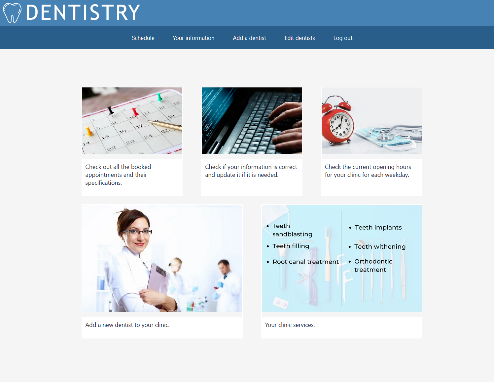
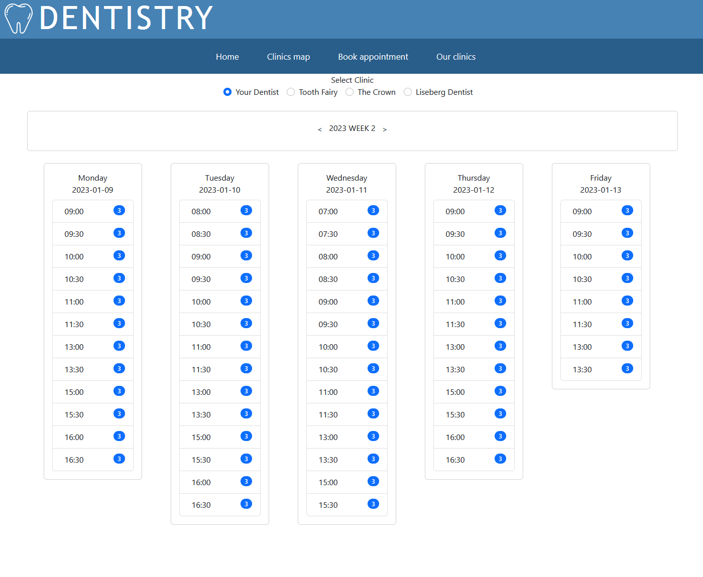
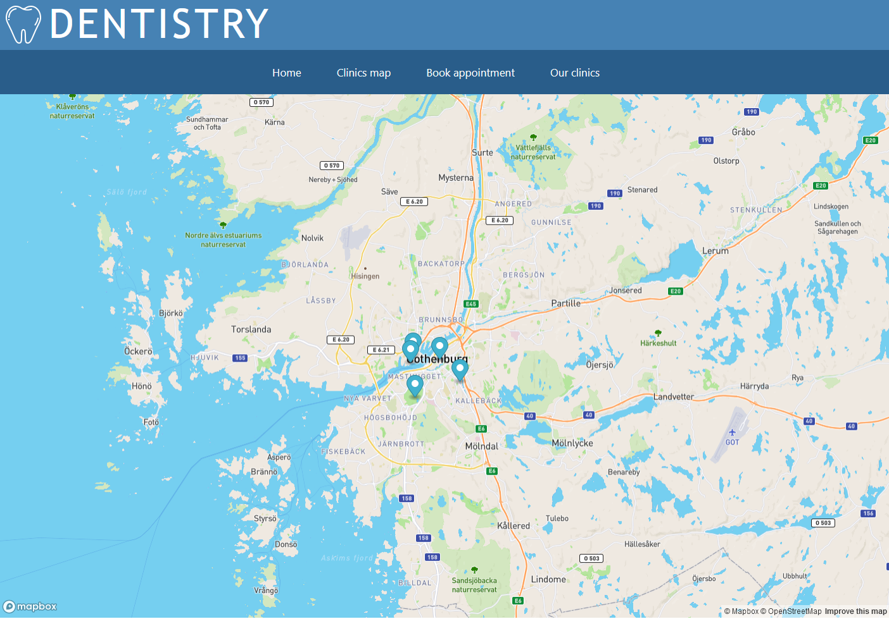
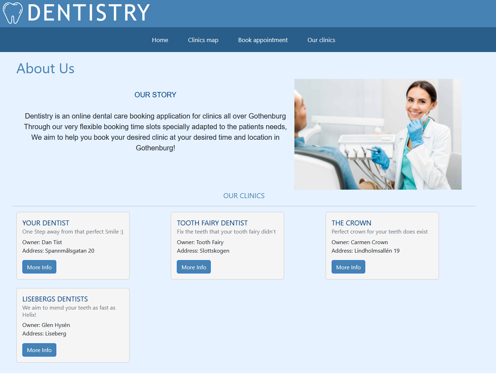
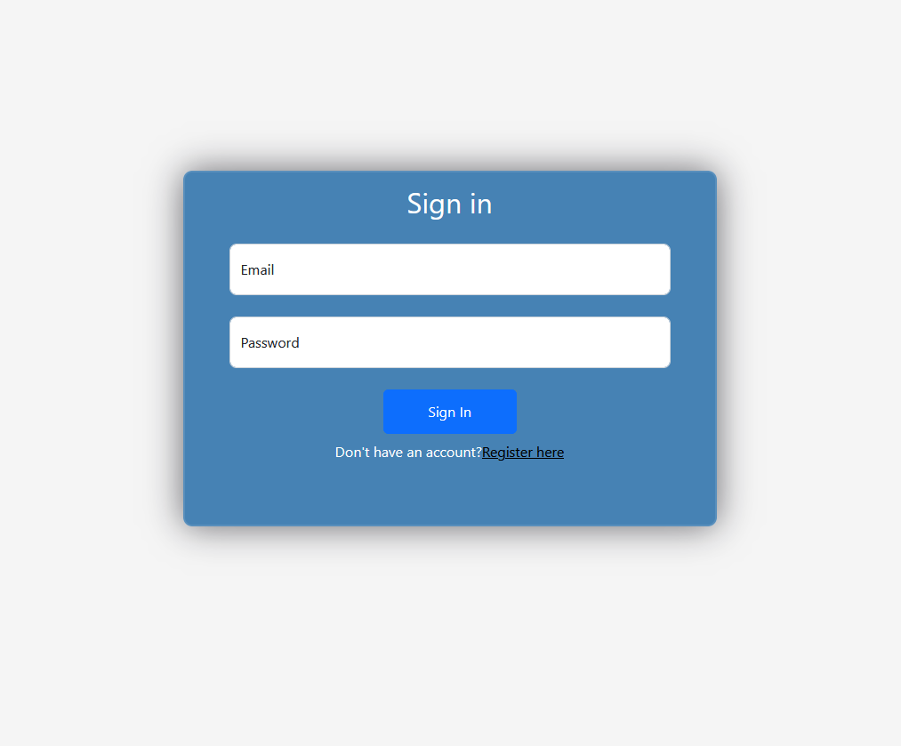
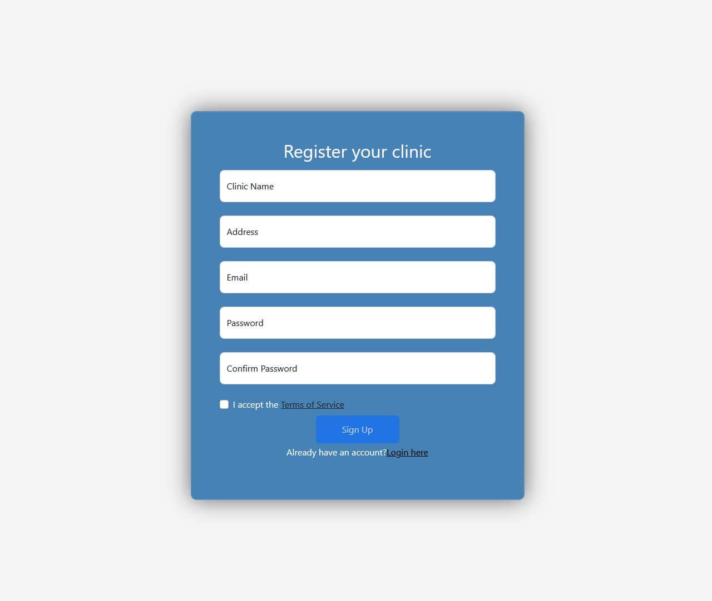
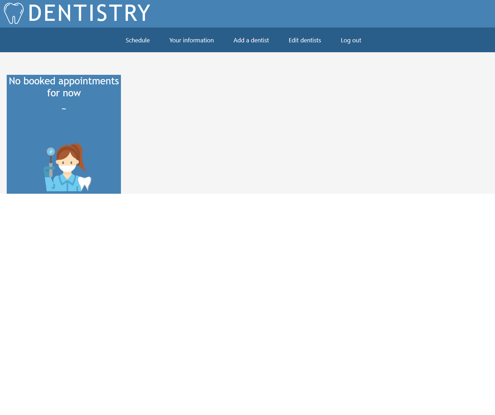
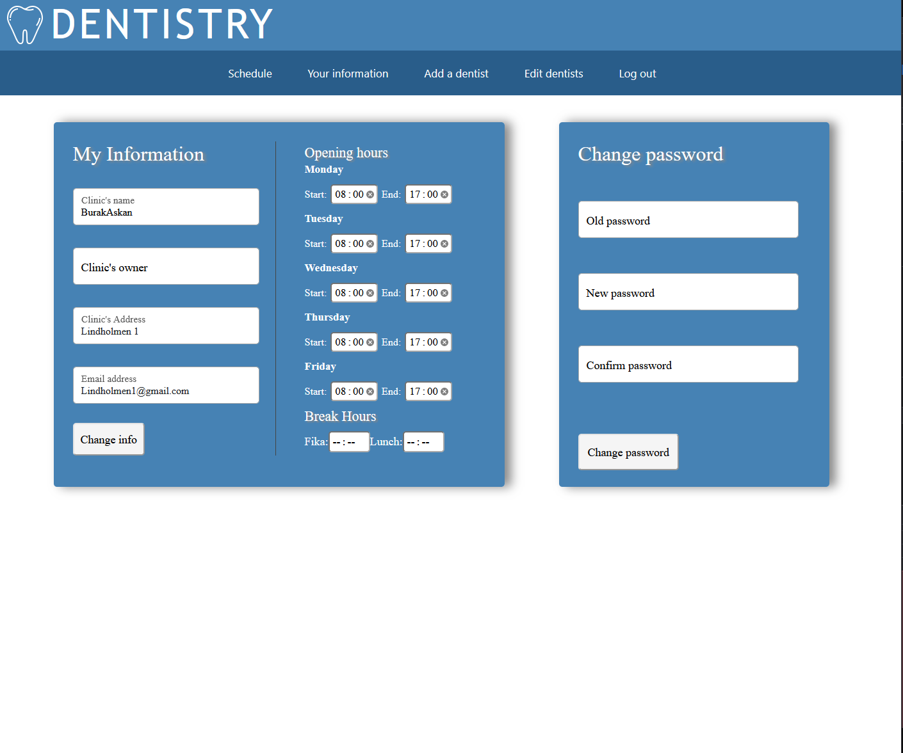
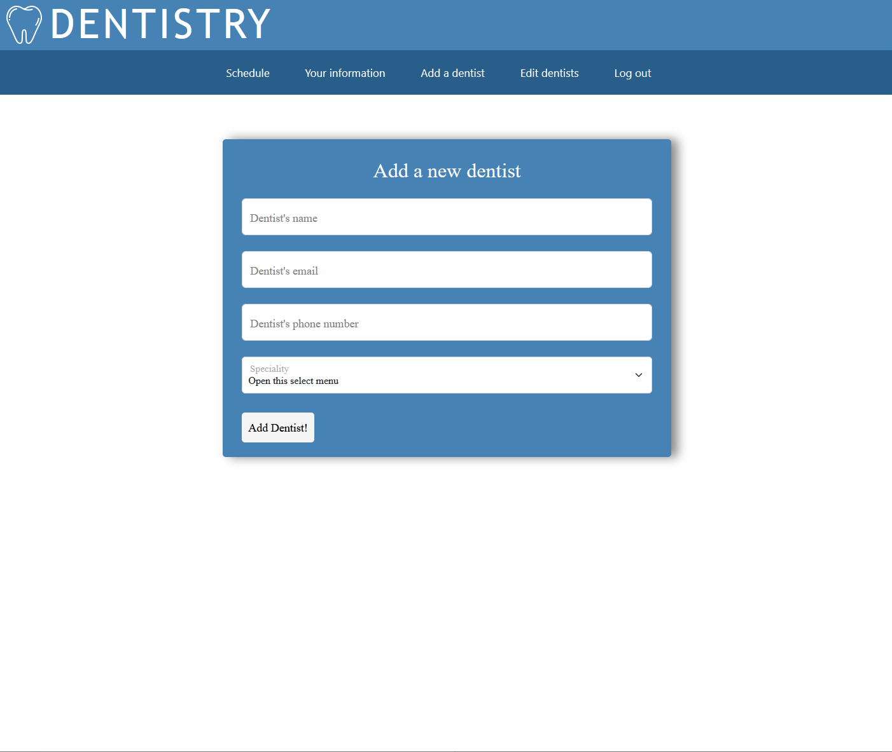
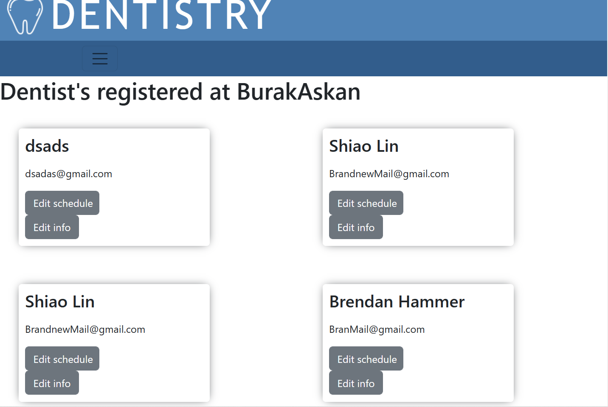

# Frontend React App

## Description
The frontend is set up using React and consists of the following directories

| Directory Name     | Purpose                                                                                                                   |
|--------------------|---------------------------------------------------------------------------------------------------------------------------|
| ClinicLogin        | Log in page for the Clinics.                                                                                              |
| ClinicRegistration | Registration page for the clinic to create account and successfully register.                                             |
| MyInformation      | Page designed for the clinic to submit information like opening hours, lunch hours, change password, and much more.       |
| Assets             | Folder to store images required for the pages.                                                                            |
| Clinics            | Helps view map that shows all the clinics.                                                                                |
| Home               | Landing page for both clinics and patients. Clinics see different content after logging in than a normal patient or user. |
| Tests              | Tests for a functioning frontend.                                                                                         |

## Visuals

This is the client home page, and what is seen as the application opens. 
From this page, the user can navigate to multiple different pages as seen in the Navbar. These include book appointment, 
the map of the clinics and a page with information about all the registered clinics.

[placeholder: the three pages connected to home page]

These pages are each connected to different backend components and have different functionalities.
The page "book appointment" is connected to the "appointments" backend component and is responsible for making sure the user is able to book appointments. 
This page also only displays the available time slots, with the help of communicating with the backend.

Moreover, the page "Clinics map" is connected to the backend component "clinic-data" and it shows where the registered clinics are located on a map. Basically, using the mapbox api we were ableto generate a map and place markers with customizable pop-ups showing our registered clinics.

Lastly, the page "Our clinics" is also connected to the backend component 
and shows information about the registered clinics at our application.

Clinics can register themselves in our application in order to access other functionalities.
From the client's homepage, clinics is able to navigate to a login page where they either log in or sign up for an account.
These pages are connected to the authorization component in the backend and manage all authorization and account creation logic.

Upon logging in, a clinic is navigated to a "clinic's home page" where there they are met with links to multiple different functionality pages.
Namely, a schedule page, a "My information", an "Add a dentist" page, and lastly, an "Edit dentist" page. 

This page shows the clinic all the current booked timeslots, with all the necessary information such as the start time, patient information, dentist name and additional information.
It is connected to the "appointments" backend component in order to fetch the necessary information.

The above pages deal with the updating the clinic's information. Furthermore, all of them
interact with the backend component "clinic-data" to fetch and update information.

Firstly, "My information page", gives the clinic an opportunity to check the current information registered and update the if needed.

Secondly, "Add a dentist", lets the clinic register a new dentist to their clinic. And lastly, "edit dentist" shows all registered dentists and 
lets the clinic make changes to each one, if needed. This includes information update, as well as an update of the dentist's schedule.

