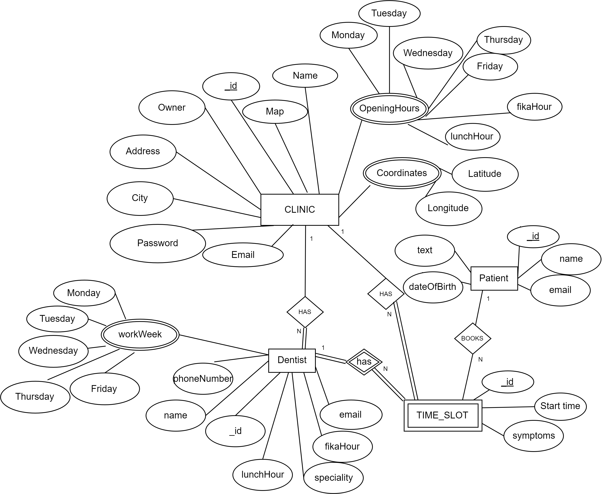

# Helpers and Schemas

## Description 
The helpers directory acts as a medium to help interact to different services to promote reusability of code and avoid to repeat the same code. It contains a file to establish a mongoose client connection and a mongoose model on a connection instance. It also contains MQTT client creation class to connect to the MQTT broker and also send messages and subscribe to topics via the MQTT connection.
There is also a schema directory which creates mongoose schemas for clinic, dentist, patient and timeslots. It is also important to note that all the files in helpers directory are utilized by all components of the repository.

## Diagram
The Entity- Relation diagram

